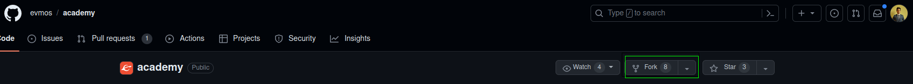
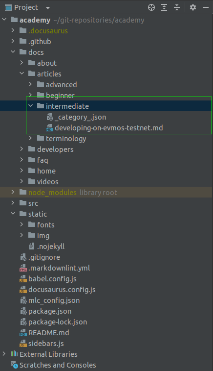

# Evmos Academy

Welcome to the Academy Docs, the official place to dive deeper into the world of Evmos. 

## How to contribute?

To contribute/update content in the Academy website, we welcome you to create a pull request.

### Steps to create a pull request:

You must have git installed and configured on your local computer. 

#### Step 1: Fork the repository:

#### Step 2: Clone the repository

SSH:

`git clone git@github.com:<usename>/academy.git`

HTTPS:

`git clone https://github.com/<username>/academy.git`

#### Step 3: Install project dependencies

Please note that the project uses `package-lock.json` lock file, therefore you are expected to install package dependencies only using `npm install`.

`npm install`

#### Step 4: Make your updates

You can contribute new content or fix typos/grammatical errors or update existing content. All of this must be done on your local device.

If you would like to contribute an article, you must first identify the category it belongs to:

- Beginner
- Intermediate
- Advanced

Let us assume the article you are creating belongs to the intermediate category.

**4.1**: Open your favorite choice of editor

`code .`

**4.2**: Create a folder for your article

You can create a new folder in docs/articles/intermediate

Create a folder with an intuitive name: `<new-article>`

**4.3**: Create a markdown file: `index.md`

In markdown, you can add text, images, videos and more.

A brief intro to markdown:

- Single # is used to create a header
- Double ## is used to create a paragraph header
- Text within `` is used for code blocks
- Lists can be added using -

**4.4**: (Optional) Add images:

Upload your image to `static/img` folder. 

Images in Markdown can be added this way:

``

#### Step 5: Add changes, commit, and push to remote

For Github to track the changes you make, you must first add the files to the staging area:

If you would like to add all files to staging:

`git add .`

If you would like to add only a specific file:

`git add <filename>`

Commit Changes:

`git commit -m "<commit-message>"`

Push to academy repository:

`git push origin main`

#### Step 6: Create a pull request on Github

Go to `https://github.com/evmos/academy`, click on Pull Requests -> New Pull Request -> Select your repo/branch in `compare` and click on Create pull request.

